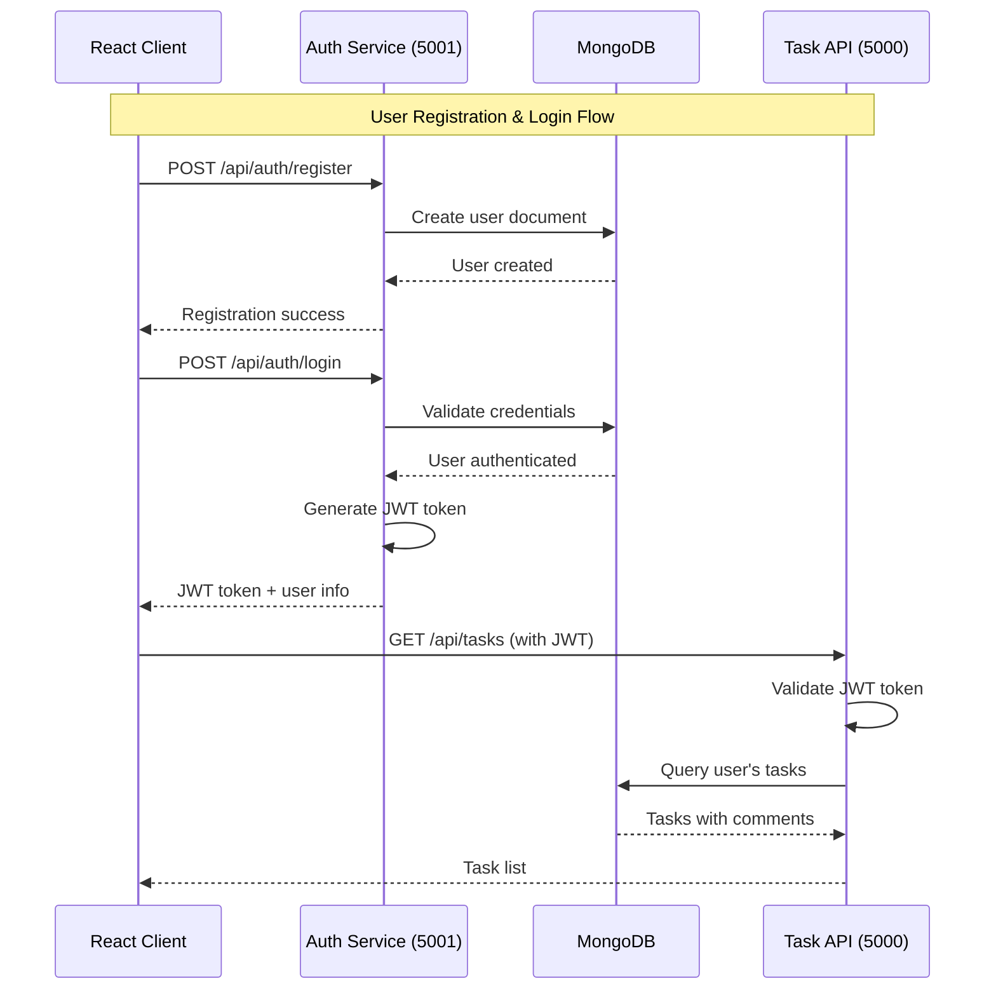
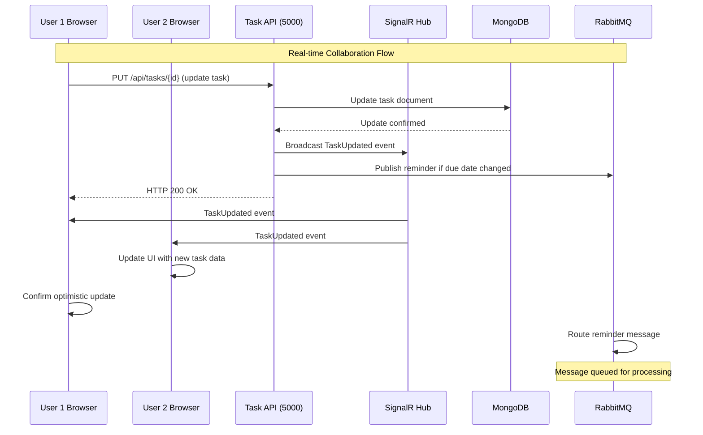
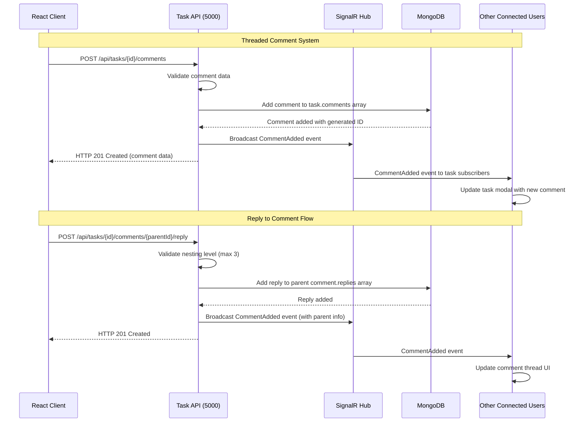
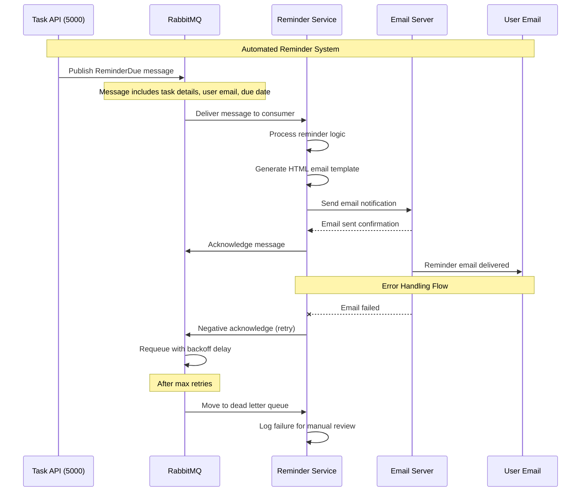
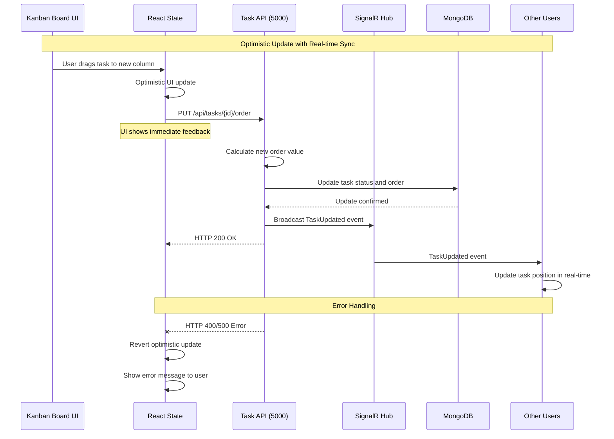

# Task Management System

A comprehensive, enterprise-grade task management system built with .NET 8, MongoDB, MassTransit + RabbitMQ, and React TypeScript. Features real-time collaboration, drag-and-drop Kanban board, intelligent reminder notifications, JWT authentication, and advanced threaded commenting system.

## 🚀 Key Features

### 📋 Task Management
- **Interactive Kanban Board**: Drag-and-drop task management with visual status columns (Todo, In Progress, Review, Done)
- **Smart Task Creation**: Create tasks with priorities, due dates, assignees, and custom tags
- **Order Management**: Persistent task ordering within columns with optimistic updates
- **Task Statistics**: Real-time dashboard showing totals, completed tasks, overdue items, and high-priority alerts
- **Click-to-Edit**: Enhanced task cards - click anywhere on a card to open the task modal

### 💬 Advanced Collaboration
- **Threaded Comments System**: Multi-level nested comments with replies (up to 3 levels deep)
- **Collapsible Replies**: Comments with replies default to collapsed, showing count (e.g., "▶ 5 replies")
- **Real-time Updates**: Live synchronization using SignalR - see comments and task changes instantly across all users
- **User Avatars**: Dynamic avatar generation for each user in comments
- **Smart Comment UI**: Contextual reply forms with cancel/submit actions

### 🔔 Intelligent Notifications
- **Automated Reminders**: Email notifications for upcoming tasks (24 hours before due date)
- **Overdue Alerts**: Automatic notifications for overdue tasks
- **Background Processing**: Reliable message queuing with RabbitMQ for notification delivery
- **Customizable Templates**: Rich HTML email templates with task details

### 🔐 Security & Authentication
- **JWT Authentication**: Secure token-based authentication with refresh tokens
- **User Registration & Login**: Complete authentication flow with input validation
- **Password Security**: BCrypt hashing for secure password storage
- **Protected Routes**: Role-based access control throughout the application

### 🎨 User Experience
- **Responsive Design**: Mobile-first design that works perfectly on all devices
- **Modern UI**: Clean, professional interface with gradient backgrounds and smooth animations
- **Compact Modal**: Optimized modal size (480px max-width) for better screen utilization
- **Visual Feedback**: Hover effects, loading states, and transition animations throughout
- **Error Handling**: Comprehensive error messages and user feedback

### 🛠️ Development & Testing
- **Comprehensive Seeding**: PowerShell script (`SeedTestingData.ps1`) that creates realistic test data
  - 6 users with different roles and specialties
  - 6 tasks with realistic workplace scenarios
  - Threaded comments with authentic workplace conversations
  - Automatic user management (smart login/registration)
- **Docker Containerization**: Complete Docker Compose setup for easy deployment
- **Development Tools**: Hot reload, debugging support, and comprehensive logging

## 🏗️ System Architecture Overview

The Task Management System follows a **microservices architecture** with **event-driven communication**, implementing **Clean Architecture principles** and **Domain-Driven Design (DDD)** patterns. The system is designed for scalability, maintainability, and real-time collaboration.

### Architecture Principles
- **Separation of Concerns**: Each service has a single, well-defined responsibility
- **Loose Coupling**: Services communicate through well-defined APIs and message queues
- **High Cohesion**: Related functionality is grouped within service boundaries
- **Event-Driven Architecture**: Asynchronous communication for non-blocking operations
- **Real-time First**: SignalR integration for immediate user feedback and collaboration

### High-Level Architecture Diagram

```
                    🌐 CLIENT LAYER
    ┌───────────────────────────────────────────────────────┐
    │                React SPA (Port 3000)                  │
    │  • Kanban Board UI    • SignalR Client               │
    │  • Real-time Updates  • State Management             │
    │  • Drag & Drop        • JWT Token Handling           │
    └───────────┬─────────────────────────┬─────────────────┘
                │ HTTP/HTTPS              │ WebSocket
                │ REST API                │ SignalR
                ▼                         ▼
    ┌───────────────────────────────────────────────────────┐
    │               🚀 API GATEWAY LAYER                    │
    │  ┌─────────────────────┐   ┌─────────────────────────┐│
    │  │  Authentication     │   │    Task Management      ││
    │  │  Service (5001)     │   │    API Service (5000)   ││
    │  │                     │   │                         ││
    │  │ • JWT Generation    │   │ • Task CRUD Operations  ││
    │  │ • User Registration │   │ • Comment Threading     ││
    │  │ • Login/Logout      │   │ • SignalR Hub          ││
    │  │ • Password Security │   │ • Real-time Broadcasts ││
    │  └─────────────────────┘   └─────────────────────────┘│
    └───────────┬─────────────────────────┬─────────────────┘
                │                         │
                ▼                         ▼
    ┌───────────────────────────────────────────────────────┐
    │             💾 DATA & MESSAGING LAYER                 │
    │  ┌─────────────────┐  ┌─────────────────────────────┐ │
    │  │   MongoDB       │  │        RabbitMQ             │ │
    │  │   Database      │  │     Message Broker          │ │
    │  │                 │  │                             │ │
    │  │ • Task Storage  │  │ • Async Communication      │ │
    │  │ • User Profiles │  │ • Email Queue               │ │
    │  │ • Comments      │  │ • Reminder Messages         │ │
    │  │ • Embedded Data │  │ • Reliable Delivery         │ │
    │  └─────────────────┘  └─────────────────────────────┘ │
    └───────────┬───────────────────────────────────────────┘
                │ Message Queue
                ▼
    ┌───────────────────────────────────────────────────────┐
    │              📧 BACKGROUND SERVICES                   │
    │  ┌─────────────────────────────────────────────────┐  │
    │  │         Reminder Service (Background)           │  │
    │  │                                                 │  │
    │  │ • Email Notifications    • SMTP Integration     │  │
    │  │ • Scheduled Reminders    • Template Rendering   │  │
    │  │ • Queue Processing       • Error Handling       │  │
    │  │ • Background Workers     • Retry Logic          │  │
    │  └─────────────────────────────────────────────────┘  │
    └───────────────────────────────────────────────────────┘

    📊 DATA FLOW:
    Frontend ↔ Auth Service (JWT tokens)
    Frontend ↔ Task API (CRUD operations)
    Task API → RabbitMQ (reminder events)
    RabbitMQ → Reminder Service (email processing)
    All Services ↔ MongoDB (data persistence)
```

## 🏢 Service Breakdown and Responsibilities

### 1. **Frontend Service (React SPA) - Port 3000**
**Primary Responsibility**: User Interface and Real-time Interaction Layer

**Key Components:**
- **KanbanBoard**: Main dashboard with drag-and-drop functionality
- **TaskModal**: Task creation/editing with threaded comments
- **SignalR Client**: Real-time communication management
- **TaskContext**: Global state management for real-time updates
- **Authentication**: Login/register forms with JWT handling

**Technologies:**
- React 19 with TypeScript for type safety
- SignalR Client for real-time updates
- React Beautiful DnD for drag-and-drop
- Axios for HTTP communication
- CSS3 with modern animations and responsive design

**Responsibilities:**
- Render interactive Kanban board with real-time updates
- Handle user authentication and session management
- Manage WebSocket connections for live collaboration
- Provide responsive, accessible user interface
- Implement optimistic updates for better UX

### 2. **Task Management API Service - Port 5000**
**Primary Responsibility**: Core Business Logic and Task Operations

**Key Components:**
- **TasksController**: RESTful endpoints for task CRUD operations
- **CommentsController**: Threaded comment management
- **TaskHub**: SignalR hub for real-time notifications
- **TaskService**: Business logic implementation
- **NotificationService**: Real-time event broadcasting

**Technologies:**
- .NET 8 Web API with minimal APIs
- SignalR for real-time communication
- AutoMapper for object mapping
- FluentValidation for input validation
- MongoDB Driver for data access

**Responsibilities:**
- Implement task lifecycle management (create, read, update, delete)
- Handle threaded comment system with nesting limits
- Broadcast real-time updates to connected clients
- Enforce business rules and data validation
- Manage task ordering and status transitions
- Publish reminder events to message queue

### 3. **Authentication Service - Port 5001**
**Primary Responsibility**: User Management and Security

**Key Components:**
- **AuthController**: Authentication endpoints
- **AuthService**: JWT token management
- **UserService**: User lifecycle operations
- **Password Management**: Secure hashing and validation

**Technologies:**
- .NET 8 Web API with JWT middleware
- BCrypt.Net for password hashing
- MongoDB for user storage
- System.IdentityModel.Tokens.Jwt for token operations

**Responsibilities:**
- Handle user registration with email validation
- Authenticate users and generate JWT tokens
- Manage user sessions and token refresh
- Enforce password security policies
- Provide user profile management
- Maintain separation of authentication from business logic

### 4. **Reminder Service (Background Worker)**
**Primary Responsibility**: Automated Notification System

**Key Components:**
- **ReminderWorker**: Scheduled background processing
- **ReminderConsumer**: MassTransit message consumer
- **EmailService**: SMTP email delivery
- **NotificationTemplates**: HTML email templates

**Technologies:**
- .NET 8 Worker Service with hosted services
- MassTransit for message consumption
- RabbitMQ for reliable message delivery
- SMTP client for email notifications
- Quartz.NET for scheduling (future enhancement)

**Responsibilities:**
- Process reminder messages from queue
- Send email notifications for upcoming due dates
- Handle overdue task notifications
- Manage email template rendering
- Ensure reliable message processing with retry logic
- Scale independently from main API services

### 5. **Message Broker (RabbitMQ)**
**Primary Responsibility**: Asynchronous Communication Hub

**Configuration:**
- **Exchange**: `reminder-exchange` (topic exchange)
- **Queues**: `task-reminders`, `overdue-notifications`
- **Routing Keys**: `reminder.due`, `reminder.overdue`
- **Dead Letter Queue**: Error handling and replay

**Responsibilities:**
- Decouple services through asynchronous messaging
- Ensure reliable message delivery with persistence
- Handle service failures with retry mechanisms
- Scale message processing independently
- Provide message durability and acknowledgments

### 6. **Database (MongoDB)**
**Primary Responsibility**: Data Persistence and Query Optimization

**Collections:**
- **Tasks**: Task documents with embedded comments
- **Users**: User profiles and authentication data
- **Indexes**: Optimized queries for performance

**Responsibilities:**
- Store task data with embedded comment threads
- Maintain user authentication information
- Provide efficient querying with proper indexing
- Handle concurrent updates with optimistic locking
- Support complex queries for filtering and searching

## 🎯 Design Decisions and Justifications

### Database Choice: MongoDB (NoSQL) vs SQL

**Why MongoDB was chosen over SQL databases:**

#### ✅ **Document Structure Alignment**
- **Threaded Comments**: Comments with nested replies map naturally to MongoDB's document structure
- **Flexible Schema**: Tasks can have varying fields (tags, custom properties) without schema migrations
- **Embedded Data**: Comments are embedded within task documents, reducing JOIN operations

#### ✅ **Scalability and Performance**
- **Horizontal Scaling**: MongoDB's sharding capabilities support future growth
- **Aggregation Pipeline**: Efficient complex queries for task statistics and filtering
- **Index Optimization**: Compound indexes for task status, priority, and due date queries

#### ✅ **Development Velocity**
- **Schema Evolution**: Easy to add new fields without database migrations
- **JSON-Native**: Seamless integration with REST APIs and JavaScript frontend
- **Rapid Prototyping**: Quick iteration on data models during development

#### ⚖️ **Trade-offs Considered**
- **ACID Transactions**: MongoDB provides multi-document transactions for critical operations
- **Data Consistency**: Eventual consistency is acceptable for task management workflows
- **Query Complexity**: Most queries are document-centric rather than relational

**Alternative Considered: PostgreSQL with JSONB**
- Would provide ACID guarantees and relational capabilities
- JSONB columns could handle flexible task properties
- **Rejected because**: MongoDB's native document handling and embedded arrays better suit comment threading

### Service Decomposition Strategy

#### **Microservices vs Monolith Decision**

**Why Microservices Architecture:**

1. **Scalability Isolation**
   - Authentication service scales differently than task operations
   - Reminder service can scale independently based on notification volume
   - Each service can be optimized for its specific workload

2. **Technology Flexibility**
   - Different services can use optimal technologies for their domain
   - Future services (file storage, analytics) can use different tech stacks
   - Easier to adopt new technologies incrementally

3. **Team Organization**
   - Services align with team expertise (frontend, backend, DevOps)
   - Independent deployment cycles reduce coordination overhead
   - Clear service boundaries improve code ownership

4. **Failure Isolation**
   - Authentication failures don't impact task operations
   - Reminder service outages don't affect core functionality
   - Circuit breaker patterns prevent cascade failures

#### **Service Boundary Decisions**

**Task API Service (Port 5000):**
- **Rationale**: Core business logic requires high consistency and real-time updates
- **Includes**: Tasks, comments, SignalR hub for immediate feedback
- **Database**: Direct MongoDB access for optimal performance

**Authentication Service (Port 5001):**
- **Rationale**: Security concerns require isolation and specialized handling
- **Includes**: User management, JWT tokens, password security
- **Database**: Shared MongoDB with separate user collection

**Reminder Service (Background):**
- **Rationale**: Asynchronous operations with different scaling requirements
- **Includes**: Email processing, scheduled notifications, template rendering
- **Communication**: Message queue decoupling for reliability

### Messaging Patterns and Communication

#### **Event-Driven Architecture with RabbitMQ**

**Message Queue Choice: RabbitMQ vs Alternatives**

**Why RabbitMQ:**
- **Reliability**: Message persistence and acknowledgments prevent data loss
- **Routing Flexibility**: Topic exchanges support complex routing patterns
- **Management Tools**: Built-in web interface for monitoring and debugging
- **MassTransit Integration**: Excellent .NET support with automatic retry and error handling

**Communication Patterns:**

1. **Synchronous (HTTP/SignalR)**:
   - User interactions requiring immediate feedback
   - Real-time updates between connected clients
   - Authentication and authorization flows

2. **Asynchronous (Message Queue)**:
   - Email notifications (non-blocking)
   - Background processing tasks
   - Cross-service event notifications

#### **Real-time Communication Strategy**

**SignalR Implementation:**
- **Hub-based Architecture**: Centralized real-time event distribution
- **Group Management**: Users subscribe to specific task updates
- **Automatic Reconnection**: Handles network interruptions gracefully
- **Scalability**: Can be scaled with Redis backplane if needed

### Error Handling and Resilience Patterns

#### **Comprehensive Error Handling Strategy**

1. **Frontend Resilience**:
   - Optimistic updates with rollback on failure
   - Retry logic for failed API calls
   - Graceful degradation when SignalR is unavailable
   - User-friendly error messages with actionable guidance

2. **API Error Handling**:
   - Global exception middleware with structured logging
   - Validation errors with detailed field-level feedback
   - HTTP status codes following REST conventions
   - Correlation IDs for request tracing across services

3. **Message Processing Resilience**:
   - Automatic retry with exponential backoff
   - Dead letter queues for failed messages
   - Circuit breaker pattern for external dependencies
   - Poison message handling

4. **Database Operations**:
   - Optimistic concurrency control for task updates
   - Connection pooling and retry logic
   - Index optimization for query performance
   - Backup and recovery procedures

### Security Architecture

#### **Authentication and Authorization Strategy**

**JWT Token Implementation:**
- **Stateless Authentication**: No server-side session storage required
- **Cross-Service Security**: Tokens validated by each service independently
- **Refresh Token Pattern**: Long-lived refresh tokens with short-lived access tokens
- **Secure Storage**: HTTPOnly cookies for token storage (future enhancement)

**Security Measures:**
- **Password Security**: BCrypt hashing with salt rounds
- **Input Validation**: FluentValidation with sanitization
- **CORS Configuration**: Restricted origins for production deployment
- **SQL Injection Prevention**: MongoDB's document model reduces SQL injection risks
- **XSS Protection**: Content Security Policy headers (future enhancement)

## 🛠️ Technology Stack

### Backend (.NET 8 Ecosystem)
- **.NET 8.0**: Web API and background services with latest C# features
- **ASP.NET Core**: High-performance web framework with dependency injection
- **MongoDB Driver**: Native MongoDB integration with strongly-typed models
- **MassTransit + RabbitMQ**: Enterprise-grade message queuing and processing
- **SignalR**: Real-time bidirectional communication
- **JWT Authentication**: Secure token-based authentication with refresh tokens
- **AutoMapper**: Object-to-object mapping for DTOs
- **FluentValidation**: Comprehensive input validation
- **BCrypt.Net**: Secure password hashing
- **Serilog**: Structured logging with multiple sinks

### Frontend (Modern React Stack)
- **React 19**: Latest React with hooks, Suspense, and concurrent features
- **TypeScript**: Type-safe JavaScript with strict type checking
- **SignalR Client**: Real-time communication with automatic reconnection
- **Axios**: HTTP client with interceptors and error handling
- **React Beautiful DnD**: Smooth drag-and-drop with accessibility support
- **React Router DOM**: Client-side routing with protected routes
- **CSS3**: Modern styling with gradients, animations, and responsive design
- **React Context**: State management for real-time updates

### Infrastructure & DevOps
- **Docker & Docker Compose**: Multi-container orchestration
- **MongoDB 7.0**: Latest document database with advanced indexing
- **RabbitMQ 3.13**: Message broker with management interface
- **Node.js 18+**: Frontend build and development server
- **PowerShell**: Automated testing and data seeding scripts
- **Docker Networks**: Service discovery and internal communication

## 📋 Prerequisites

- [Docker Desktop](https://www.docker.com/products/docker-desktop/)
- [.NET 8 SDK](https://dotnet.microsoft.com/download/dotnet/8.0) (for development)
- [Node.js 18+](https://nodejs.org/) (for development)
- SMTP email server access (Gmail, Outlook, etc.) for notifications

## 🚀 Quick Start with Docker Compose

1. **Clone the repository**
   ```bash
   git clone <repository-url>
   cd "Task Management"
   ```

2. **Configure environment variables**
   
   Edit the `docker-compose.yml` file and update these environment variables:
   
   ```yaml
   # RabbitMQ Configuration (for message queuing)
   RabbitMq__Host: "rabbitmq"
   RabbitMq__Port: "5672"
   RabbitMq__Username: "taskuser"
   RabbitMq__Password: "taskpass"
   RabbitMq__VirtualHost: "/"
   
   # Email Configuration (for notifications)
   Email__SmtpServer: "smtp.gmail.com"
   Email__SmtpPort: "587"
   Email__Username: "your-email@gmail.com"
   Email__Password: "your-app-password"
   
   # JWT Secret (change this!)
   Jwt__SecretKey: "your-super-secret-jwt-key-that-is-at-least-32-characters-long"
   ```

3. **Run the application**
   ```bash
   docker-compose up --build
   ```

4. **Access the application**
   - **Frontend**: http://localhost:3000 (React SPA)
   - **Main API**: http://localhost:5000 (Task Management API)
   - **Auth API**: http://localhost:5001 (Authentication Service)
   - **API Documentation**: http://localhost:5000/swagger (Swagger UI)
   - **MongoDB**: localhost:27017 (Database access)
   - **RabbitMQ Management**: http://localhost:15672 (user: taskuser, pass: taskpass)

5. **Seed test data** (Optional)
   ```powershell
   # Run the comprehensive seeding script
   .\SeedTestingData.ps1
   ```
   This creates 6 users and 6 tasks with realistic threaded comments for testing.

## 🧪 Test Data Seeding

The system includes a comprehensive PowerShell seeding script (`SeedTestingData.ps1`) that creates realistic test data for development and demonstration purposes.

### What the Script Creates:
- **5 Diverse Users** with realistic roles and specializations:
  - System Administrator (admin access)
  - Project Manager (oversight and coordination)
  - Backend Developer (API and database work)
  - UI/UX Designer (frontend and design)
  - QA Engineer (testing and quality assurance)

- **6 Realistic Tasks** covering common workplace scenarios:
  - Security Audit (Critical priority, security focus)
  - Dashboard Redesign (Medium priority, UI/UX work)
  - API Versioning (High priority, backend development)
  - Database Optimization (High priority, performance)
  - Automated Testing (High priority, QA focus)
  - Memory Leak Bug Fix (Critical priority, debugging)

- **Authentic Threaded Comments** with realistic workplace conversations:
  - Progress updates and status reports
  - Technical discussions and problem-solving
  - Collaboration between different team roles
  - Multi-level nested replies (realistic threading)

### Key Script Features:
- **Smart User Management**: Handles existing users automatically (login if exists, register if new)
- **Clean Re-seeding**: Clears existing tasks while preserving user accounts
- **Error Handling**: Comprehensive error handling with detailed feedback
- **Progress Tracking**: Visual progress indicators and success confirmations
- **Verification**: Complete testing of all major system features

### Usage:
```powershell
# Run from the root directory (ensure Docker containers are running)
.\SeedTestingData.ps1
```

The script will automatically:
1. Verify Docker containers are running
2. Clear existing tasks (preserves users)
3. Create/authenticate 5 different users
4. Create 6 tasks with realistic workplace data
5. Add threaded comments with authentic conversations
6. Provide detailed progress feedback and verification

## 👤 Example User Credentials and Usage Flows

### Pre-seeded Test Users (via SeedTestingData.ps1)

The seeding script creates these realistic user accounts for testing:

| Email | Password | Role | Specialization |
|-------|----------|------|----------------|
| `admin@taskmanagement.com` | `Admin123!` | System Administrator | System management and oversight |
| `pm@taskmanagement.com` | `Manager123!` | Project Manager | Project coordination and planning |
| `john.dev@taskmanagement.com` | `Dev123!` | Backend Developer | API development and system architecture |
| `sarah.design@taskmanagement.com` | `Design123!` | UI/UX Designer | User interface and experience design |
| `mike.qa@taskmanagement.com` | `QA123!` | QA Engineer | Quality assurance and testing |

### Manual User Registration Flow

1. **Register New User**:
   ```bash
   POST http://localhost:5001/api/auth/register
   Content-Type: application/json
   
   {
     "email": "newuser@company.com",
     "password": "SecurePass123!",
     "name": "New User"
   }
   ```

2. **Login Flow**:
   ```bash
   POST http://localhost:5001/api/auth/login
   Content-Type: application/json
   
   {
     "email": "newuser@company.com",
     "password": "SecurePass123!"
   }
   ```

### Complete Usage Workflow Examples

#### **Scenario 1: New User Onboarding**

1. **Access Application**: Navigate to http://localhost:3000
2. **Register Account**: 
   - Click "Register" on login page
   - Enter email: `testuser@example.com`
   - Enter password: `TestPass123!`
   - Enter name: `Test User`
   - Submit form
3. **First Login**: 
   - Use credentials to login
   - Redirected to empty Kanban board
4. **Create First Task**:
   - Click "✨ Add Task" button
   - Fill task details:
     - Title: "Setup development environment"
     - Description: "Install necessary tools and configure workspace"
     - Priority: Medium (2)
     - Due Date: Tomorrow's date
     - Tags: "setup, development"
   - Save task
5. **Add Comment**:
   - Click on created task card
   - Scroll to comments section
   - Add comment: "Starting with IDE setup and project cloning"
   - Submit comment

#### **Scenario 2: Multi-User Collaboration** (using pre-seeded users)

1. **User A (Project Manager)**:
   - Login: `pm@taskmanagement.com` / `Manager123!`
   - Create task: "Implement user authentication"
   - Assign to: `john.dev@taskmanagement.com`
   - Set priority: High
   - Add comment: "Please review security requirements and implement OAuth 2.0"

2. **User B (Developer)**:
   - Login: `john.dev@taskmanagement.com` / `Dev123!`
   - See real-time notification of new assignment
   - Open task and reply to comment: "I'll start with JWT implementation and security review"
   - Move task from "Todo" to "In Progress"

3. **Real-time Collaboration**:
   - User A sees status change instantly (no page refresh)
   - Comment reply appears in real-time
   - Task card updates position automatically

#### **Scenario 3: Complete Task Lifecycle**

1. **Task Creation**:
   ```bash
   # Login first to get JWT token
   POST http://localhost:5001/api/auth/login
   
   # Create task with token
   POST http://localhost:5000/api/tasks
   Authorization: Bearer <jwt-token>
   {
     "title": "Fix login bug",
     "description": "Users cannot login after deployment",
     "priority": 3,
     "status": 0,
     "assigneeEmail": "john.dev@taskmanagement.com",
     "dueDate": "2025-08-10T09:00:00Z",
     "tags": ["bug", "critical", "authentication"]
   }
   ```

2. **Add Progress Comments**:
   ```bash
   POST http://localhost:5000/api/tasks/{taskId}/comments
   Authorization: Bearer <jwt-token>
   {
     "content": "Investigating the JWT token validation issue",
     "authorEmail": "john.dev@taskmanagement.com",
     "authorName": "John Developer"
   }
   ```

3. **Team Collaboration**:
   - QA Engineer adds testing results as replies
   - Security specialist reviews code changes
   - Project manager tracks progress through comments

4. **Task Completion**:
   - Drag task to "Done" column
   - Add final comment: "Bug fixed and deployed to production"
   - Real-time updates notify all team members

#### **Scenario 4: Reminder System Testing**

1. **Setup Email Configuration** (docker-compose.yml):
   ```yaml
   Email__SmtpServer: "smtp.gmail.com"
   Email__SmtpPort: "587"
   Email__Username: "your-test-email@gmail.com"
   Email__Password: "your-app-password"
   ```

2. **Create Task with Near Due Date**:
   - Set due date to tomorrow
   - Assign to test user
   - Wait for automated reminder email (24 hours before due)

3. **Overdue Task Testing**:
   - Create task with yesterday's due date
   - Check for overdue notification email
   - Verify task shows overdue indicator in UI

### API Testing with Postman/curl

#### **Authentication Flow**:
```bash
# Register
curl -X POST http://localhost:5001/api/auth/register \
  -H "Content-Type: application/json" \
  -d '{"email":"test@example.com","password":"Test123!","name":"Test User"}'

# Login and save token
curl -X POST http://localhost:5001/api/auth/login \
  -H "Content-Type: application/json" \
  -d '{"email":"test@example.com","password":"Test123!"}'
```

#### **Task Operations**:
```bash
# Get all tasks (requires JWT token)
curl -X GET http://localhost:5000/api/tasks \
  -H "Authorization: Bearer <your-jwt-token>"

# Create task
curl -X POST http://localhost:5000/api/tasks \
  -H "Authorization: Bearer <your-jwt-token>" \
  -H "Content-Type: application/json" \
  -d '{"title":"Test Task","description":"Testing API","priority":1,"status":0}'
```

## 🔧 Development Setup

### Backend Development

1. **Navigate to the src directory**
   ```bash
   cd src
   ```

2. **Restore packages**
   ```bash
   dotnet restore
   ```

3. **Set up user secrets** (recommended for development)
   ```bash
   cd TaskManagement.API
   dotnet user-secrets init
   dotnet user-secrets set "Database:ConnectionString" "mongodb://localhost:27017/TaskManagementDB"
   dotnet user-secrets set "Database:DatabaseName" "TaskManagementDB"
   dotnet user-secrets set "RabbitMq:Host" "localhost"
   dotnet user-secrets set "RabbitMq:Username" "taskuser"
   dotnet user-secrets set "RabbitMq:Password" "taskpass"
   dotnet user-secrets set "Email:Username" "your-email@gmail.com"
   dotnet user-secrets set "Email:Password" "your-app-password"
   ```

4. **Run the API**
   ```bash
   dotnet run --project TaskManagement.API
   ```

5. **Run the Reminder Service** (in another terminal)
   ```bash
   dotnet run --project TaskManagement.ReminderService
   ```

### Frontend Development

1. **Navigate to frontend directory**
   ```bash
   cd src/TaskManagement.Frontend
   ```

2. **Install dependencies**
   ```bash
   npm install --legacy-peer-deps
   ```

3. **Start development server**
   ```bash
   npm start
   ```

## 📱 System Usage Guide

### 🚀 Getting Started
1. **Register**: Create a new account with email and password
2. **Login**: Sign in with your credentials to access the dashboard
3. **Dashboard Overview**: View task statistics and board overview
4. **Create Tasks**: Use the "✨ Add Task" button to create new tasks with:
   - Title and detailed description
   - Priority levels (Low, Medium, High, Critical)
   - Due dates with calendar picker
   - Assignee email addresses
   - Custom tags (comma-separated)

### 📋 Task Management
- **Kanban Workflow**: Organize tasks across four columns:
  - **Todo**: New tasks awaiting action
  - **In Progress**: Tasks currently being worked on
  - **Review**: Tasks ready for review or testing
  - **Done**: Completed tasks

- **Drag & Drop**: Seamlessly move tasks between columns with persistent ordering
- **Smart Ordering**: Tasks maintain their position within columns across page refreshes
- **Click to Edit**: Click anywhere on a task card to open the detailed modal
- **Visual Priority**: Color-coded priority indicators (Green → Red)
- **Due Date Alerts**: Visual indicators for overdue tasks

### 💬 Collaboration Features
- **Threaded Comments**: 
  - Click on any task to add comments
  - Reply to existing comments (up to 3 levels deep)
  - Collapsible reply threads (default collapsed with count display)
  - Real-time updates - see new comments instantly

- **Real-time Collaboration**:
  - Multiple users can work simultaneously
  - See task updates in real-time without refreshing
  - Comment additions appear instantly for all users
  - SignalR ensures reliable real-time synchronization

- **User Identification**:
  - Dynamic avatars generated for each user
  - Timestamp tracking for all comments and replies
  - Clear authorship indication in comment threads

### 🔔 Notification System
- **Automated Reminders**: 
  - Email notifications 24 hours before due dates
  - Overdue task alerts for missed deadlines
  - Rich HTML email templates with task details

- **Background Processing**: 
  - Reliable message queuing ensures delivery
  - Independent reminder service handles notifications
  - No impact on main application performance

### 📊 Dashboard Features
- **Real-time Statistics**: 
  - Total task count across all statuses
  - Completed task metrics
  - Overdue task warnings (red indicator)
  - High-priority task alerts (priority indicator)

- **Development Tools** (Development Mode):
  - "🐛 Debug Orders" button for troubleshooting drag-and-drop
  - Console logging for real-time events
  - Task order verification tools

## 🔧 Configuration

### Environment Variables

### API Service (Port 5000)
| Variable | Description | Default |
|----------|-------------|---------|
| `Database__ConnectionString` | MongoDB connection string | `mongodb://localhost:27017/TaskManagementDB` |
| `Database__DatabaseName` | MongoDB database name | `TaskManagementDB` |
| `RabbitMq__Host` | RabbitMQ host address | `localhost` |
| `RabbitMq__Port` | RabbitMQ port | `5672` |
| `RabbitMq__Username` | RabbitMQ username | `taskuser` |
| `RabbitMq__Password` | RabbitMQ password | `taskpass` |
| `RabbitMq__VirtualHost` | RabbitMQ virtual host | `/` |
| `Jwt__SecretKey` | JWT signing key (32+ chars) | Required |
| `Jwt__Issuer` | JWT token issuer | `TaskManagementAPI` |
| `Jwt__Audience` | JWT token audience | `TaskManagementClient` |
| `Jwt__ExpiryHours` | Token expiry in hours | `24` |

### Authentication Service (Port 5001)
| Variable | Description | Default |
|----------|-------------|---------|
| `Database__ConnectionString` | MongoDB connection string | `mongodb://localhost:27017/TaskManagementDB` |
| `Database__DatabaseName` | MongoDB database name | `TaskManagementDB` |
| `Jwt__SecretKey` | JWT signing key (same as API) | Required |
| `Jwt__Issuer` | JWT token issuer | `TaskManagementAPI` |
| `Jwt__Audience` | JWT token audience | `TaskManagementClient` |
| `Jwt__ExpiryHours` | Token expiry in hours | `24` |

#### Email Configuration
| Variable | Description | Example |
|----------|-------------|---------|
| `Email__SmtpServer` | SMTP server address | `smtp.gmail.com` |
| `Email__SmtpPort` | SMTP server port | `587` |
| `Email__EnableSsl` | Enable SSL/TLS | `true` |
| `Email__Username` | Email username | `your-email@gmail.com` |
| `Email__Password` | Email password/app password | `your-app-password` |
| `Email__FromName` | Sender display name | `Task Management System` |

### Setting up Email (Gmail Example)

1. **Enable 2-Factor Authentication** on your Gmail account
2. **Generate App Password**: 
   - Go to Google Account settings
   - Security → 2-Step Verification → App passwords
   - Generate password for "Mail"
3. **Use the app password** in the `Email__Password` setting

### RabbitMQ Setup

RabbitMQ is automatically configured via Docker Compose with:
- **Host**: localhost (or `rabbitmq` in Docker network)
- **Port**: 5672 (AMQP), 15672 (Management UI)
- **Username**: taskuser
- **Password**: taskpass
- **Management UI**: http://localhost:15672

## 🧪 Testing & Quality Assurance

### Automated Test Data

For comprehensive testing, run the seeding script:

```powershell
# Create complete test environment with users, tasks, and threaded comments
.\SeedTestingData.ps1
```

**What gets created:**
- 5 diverse users with realistic roles and credentials
- 6 workplace tasks with varying priorities and due dates  
- 50+ threaded comments with authentic workplace conversations
- Complete workflow testing scenarios across all features
- Real-time collaboration test data

**Perfect for testing:**
- User authentication and authorization flows
- Task creation, editing, and status management
- Real-time collaboration features
- Comment threading and reply functionality
- Drag-and-drop operations and state persistence
- Email notification systems (with test due dates)

### Manual Testing Scenarios
1. **Authentication Flow**:
   - User registration with validation
   - Login/logout functionality
   - JWT token persistence and expiration

2. **Task Management**:
   - Create tasks with all field types
   - Drag-and-drop between columns
   - Task order persistence across refreshes
   - Priority and due date handling

3. **Real-time Collaboration**:
   - Open multiple browser tabs/incognito windows
   - Add comments in one tab, verify instant updates in others
   - Test threaded replies and collapse/expand functionality
   - Verify SignalR reconnection on network interruption

4. **Comment System**:
   - Add top-level comments
   - Create nested replies (test 3-level depth limit)
   - Toggle reply visibility (collapse/expand)
   - Verify real-time comment synchronization

5. **Responsive Design**:
   - Test on mobile devices (phone/tablet)
   - Verify drag-and-drop works on touch devices
   - Check modal sizing and readability
   - Test navigation and button accessibility

### Development Testing Tools
```bash
# Backend API tests
cd src
dotnet test

# Frontend component tests  
cd src/TaskManagement.Frontend
npm test

# API documentation and testing
# Visit: http://localhost:5000/swagger
```

### Monitoring & Debugging
1. **API Endpoints**: Swagger UI at http://localhost:5000/swagger
2. **SignalR Connection**: Browser console shows connection logs and events
3. **RabbitMQ Management**: http://localhost:15672 for message queue monitoring
4. **Email Testing**: Check configured email for reminder notifications
5. **Database Queries**: MongoDB Compass at mongodb://localhost:27017
6. **Real-time Events**: Browser DevTools → Network → WS tab for SignalR messages

## 📁 Project Structure

```
src/
├── TaskManagement.API/              # Main Web API (Port 5000)
│   ├── Controllers/                 # REST API controllers
│   │   ├── TasksController.cs       # Task CRUD operations
│   │   └── CommentsController.cs    # Comment management
│   ├── Hubs/                       # SignalR real-time communication
│   │   └── TaskHub.cs              # Real-time task and comment updates
│   ├── Services/                   # Business logic services
│   │   ├── TaskService.cs          # Task business logic
│   │   └── NotificationService.cs  # SignalR notification dispatch
│   ├── Middleware/                 # Custom middleware
│   └── Program.cs                  # Application entry point & configuration
├── TaskManagement.Auth/            # Authentication Service (Port 5001)
│   ├── Controllers/                # Authentication controllers
│   │   └── AuthController.cs       # Login, register, token management
│   ├── Services/                   # Authentication services
│   │   └── AuthService.cs          # JWT token generation & validation
│   └── Program.cs                  # Auth service configuration
├── TaskManagement.Domain/          # Domain entities and contracts
│   ├── Entities/                   # Database entities
│   │   ├── Task.cs                 # Task entity with comments
│   │   ├── User.cs                 # User entity
│   │   └── TaskComment.cs          # Comment entity (threaded)
│   ├── DTOs/                       # Data transfer objects
│   │   ├── TaskResponse.cs         # Task API responses
│   │   ├── CreateTaskRequest.cs    # Task creation requests
│   │   └── TaskCommentResponse.cs  # Comment API responses
│   └── Enums/                      # System enumerations
│       ├── TaskStatus.cs           # Todo, InProgress, Review, Done
│       └── Priority.cs             # Low, Medium, High, Critical
├── TaskManagement.Infrastructure/   # Data access and external services
│   ├── Data/                       # Database operations
│   │   ├── MongoDbContext.cs       # MongoDB context and configuration
│   │   ├── TaskRepository.cs       # Task data operations
│   │   └── UserRepository.cs       # User data operations
│   ├── Messaging/                  # MassTransit message handling
│   │   ├── ReminderConsumer.cs     # Processes reminder messages
│   │   └── MessagingConfiguration.cs # RabbitMQ setup
│   └── Services/                   # External integrations
│       └── EmailService.cs         # SMTP email delivery
├── TaskManagement.ReminderService/ # Background notification service
│   ├── Workers/                    # Background workers
│   │   └── ReminderWorker.cs       # Scheduled reminder processing
│   ├── Services/                   # Reminder business logic
│   └── Program.cs                  # Service configuration
├── TaskManagement.Frontend/        # React TypeScript SPA
│   ├── public/                     # Static assets
│   ├── src/
│   │   ├── components/             # React components
│   │   │   ├── KanbanBoard.tsx     # Main dashboard with drag-drop
│   │   │   ├── TaskCard.tsx        # Individual task cards
│   │   │   ├── TaskModal.tsx       # Task editing modal
│   │   │   ├── Login.tsx           # Authentication component
│   │   │   └── *.css              # Component-specific styling
│   │   ├── contexts/               # React context providers
│   │   │   └── TaskContext.tsx     # Global state management
│   │   ├── services/               # External service integrations
│   │   │   ├── apiService.ts       # HTTP API client
│   │   │   └── signalRService.ts   # Real-time communication
│   │   ├── types/                  # TypeScript definitions
│   │   └── App.tsx                 # Main application component
├── SeedTestingData.ps1             # Comprehensive test data seeding
├── docker-compose.yml              # Multi-container orchestration
├── Dockerfile.api                  # API service container
├── Dockerfile.auth                 # Auth service container  
├── Dockerfile.reminder             # Reminder service container
├── Dockerfile.frontend             # Frontend container
└── init-mongo.js                   # MongoDB initialization
```

## � Sequence Diagrams

### 1. User Authentication Flow



### 2. Real-time Task Update Flow



### 3. Comment Creation with Threading



### 4. Background Reminder Processing



### 5. Drag-and-Drop Task Movement



## �🔍 API Documentation

### Authentication Endpoints (Port 5001)
- `POST /api/auth/register` - User registration with email/password validation
- `POST /api/auth/login` - User login with JWT token generation
- `GET /api/auth/me` - Get current user information from JWT token

### Task Management Endpoints (Port 5000)
- `GET /api/tasks` - Get user's tasks with comments and threading
- `GET /api/tasks/{id}` - Get specific task with full comment tree
- `POST /api/tasks` - Create new task with validation
- `PUT /api/tasks/{id}` - Update task (triggers real-time updates)
- `DELETE /api/tasks/{id}` - Delete task (with cascade comment deletion)
- `PUT /api/tasks/{id}/order` - Update task order and status (drag-drop)

### Comment Endpoints (Port 5000)
- `POST /api/tasks/{taskId}/comments` - Add top-level comment to task
- `POST /api/tasks/{taskId}/comments/{parentId}/reply` - Add threaded reply
- `GET /api/tasks/{taskId}/comments` - Get comment tree for task
- `PUT /api/comments/{id}` - Update comment content
- `DELETE /api/comments/{id}` - Delete comment (preserves thread structure)

### SignalR Hub Events (`/taskhub`)
**Client → Server Events:**
- `JoinGroup(taskId)` - Subscribe to task-specific updates
- `LeaveGroup(taskId)` - Unsubscribe from task updates

**Server → Client Events:**
- `TaskCreated(task)` - New task added to board
- `TaskUpdated(task)` - Task modified (status, content, order)
- `TaskDeleted(taskId)` - Task removed from board
- `CommentAdded(taskId, comment)` - New comment/reply added
- `CommentUpdated(taskId, comment)` - Comment modified
- `CommentDeleted(taskId, commentId)` - Comment removed

### Request/Response Examples

**Create Task:**
```json
POST /api/tasks
{
  "title": "Fix critical bug in authentication",
  "description": "Users unable to login after latest deployment",
  "priority": 3,
  "status": 0,
  "assigneeEmail": "developer@company.com",
  "dueDate": "2025-08-10T10:00:00Z",
  "tags": ["bug", "critical", "authentication"]
}
```

**Add Comment:**
```json
POST /api/tasks/{taskId}/comments
{
  "content": "Started investigating the issue. Initial findings suggest a JWT token validation problem.",
  "authorEmail": "developer@company.com",
  "authorName": "John Developer"
}
```

## 🐛 Troubleshooting

### Common Issues

1. **Docker Build Fails**
   ```bash
   # Clean Docker cache
   docker system prune -f
   docker-compose build --no-cache
   ```

2. **MongoDB Connection Issues**
   ```bash
   # Check MongoDB container logs
   docker logs task-management-mongodb
   
   # Verify MongoDB is running
   docker ps | grep mongo
   ```

3. **MongoDB Connection Issues**
   ```bash
   # Check MongoDB container logs
   docker logs task-management-mongodb
   
   # Verify MongoDB is running
   docker ps | grep mongo
   ```

4. **Email Notifications Not Working**
   - Verify SMTP settings in configuration
   - Check RabbitMQ connection and message processing
   - Ensure RabbitMQ queues exist and have proper permissions
   - Review reminder service logs

5. **RabbitMQ Connection Issues**
   ```bash
   # Check RabbitMQ container logs
   docker logs task-management-rabbitmq
   
   # Access RabbitMQ Management UI
   # http://localhost:15672 (user: taskuser, pass: taskpass)
   ```

4. **SignalR Connection Fails**
   - Check CORS configuration in API
   - Verify JWT token is valid
   - Monitor browser console for connection errors

6. **Frontend Build Issues**
   ```bash
   # Clear npm cache and reinstall
   cd src/TaskManagement.Frontend
   rm -rf node_modules package-lock.json
   npm install --legacy-peer-deps
   ```

### Logs
```bash
# View all service logs
docker-compose logs

# View specific service logs
docker-compose logs task-management-api
docker-compose logs task-management-reminder
docker-compose logs task-management-frontend
docker-compose logs task-management-rabbitmq
```

## 🏗️ Code Quality Standards

### Naming Conventions

#### **C# Backend Services**
- **Classes**: PascalCase (`TaskService`, `AuthController`, `TaskResponse`)
- **Methods**: PascalCase (`CreateTaskAsync`, `ValidateUser`, `GetTaskById`)
- **Properties**: PascalCase (`TaskId`, `CreatedAt`, `AssigneeEmail`)
- **Fields**: camelCase with underscore prefix (`_logger`, `_taskRepository`)
- **Constants**: PascalCase (`MaxCommentNestingLevel`, `DefaultPageSize`)
- **Interfaces**: PascalCase with 'I' prefix (`ITaskService`, `IAuthService`)

#### **TypeScript Frontend**
- **Components**: PascalCase (`KanbanBoard`, `TaskModal`, `TaskCard`)
- **Functions**: camelCase (`handleDragEnd`, `loadTasks`, `createTask`)
- **Variables**: camelCase (`currentTask`, `isLoading`, `userEmail`)
- **Constants**: SCREAMING_SNAKE_CASE (`TASK_STATUSES`, `API_BASE_URL`)
- **Types/Interfaces**: PascalCase (`TaskResponse`, `CreateTaskRequest`)

#### **Database Collections & Fields**
- **Collections**: PascalCase (`Tasks`, `Users`, `Comments`)
- **Document Fields**: camelCase (`taskId`, `createdAt`, `assigneeEmail`)
- **Indexes**: Descriptive names (`idx_tasks_status_priority`, `idx_users_email`)

### Project Structure Standards

#### **Service Layer Organization**
```csharp
// Consistent service interface pattern
public interface ITaskService
{
    Task<TaskResponse> CreateTaskAsync(CreateTaskRequest request);
    Task<TaskResponse> GetTaskByIdAsync(string taskId);
    Task<IEnumerable<TaskResponse>> GetUserTasksAsync(string userEmail);
    Task<TaskResponse> UpdateTaskAsync(string taskId, UpdateTaskRequest request);
    Task DeleteTaskAsync(string taskId);
}

// Implementation with consistent error handling
public class TaskService : ITaskService
{
    private readonly ITaskRepository _taskRepository;
    private readonly ILogger<TaskService> _logger;
    private readonly INotificationService _notificationService;

    public async Task<TaskResponse> CreateTaskAsync(CreateTaskRequest request)
    {
        try
        {
            _logger.LogInformation("Creating task for user {UserEmail}", request.AssigneeEmail);
            
            // Validation
            if (string.IsNullOrWhiteSpace(request.Title))
                throw new ValidationException("Task title is required");

            // Business logic
            var task = _mapper.Map<Task>(request);
            task.Id = ObjectId.GenerateNewId().ToString();
            task.CreatedAt = DateTime.UtcNow;

            // Persistence
            await _taskRepository.CreateAsync(task);

            // Side effects
            await _notificationService.NotifyTaskCreatedAsync(task);

            return _mapper.Map<TaskResponse>(task);
        }
        catch (Exception ex)
        {
            _logger.LogError(ex, "Failed to create task for user {UserEmail}", request.AssigneeEmail);
            throw;
        }
    }
}
```

#### **React Component Structure**
```typescript
// Consistent component structure
interface TaskModalProps {
  task?: TaskResponse;
  onClose: () => void;
  onSave: () => void;
}

const TaskModal: React.FC<TaskModalProps> = ({ task, onClose, onSave }) => {
  // 1. State declarations
  const [formData, setFormData] = useState<CreateTaskRequest>({
    title: task?.title || '',
    description: task?.description || '',
    // ... other fields
  });
  const [isLoading, setIsLoading] = useState(false);
  const [error, setError] = useState<string | null>(null);

  // 2. Hooks and context
  const { dispatch } = useTask();

  // 3. Event handlers
  const handleSubmit = async (e: React.FormEvent) => {
    e.preventDefault();
    setIsLoading(true);
    setError(null);

    try {
      if (task) {
        await apiService.updateTask(task.id, formData);
      } else {
        await apiService.createTask(formData);
      }
      onSave();
    } catch (error) {
      setError(error instanceof Error ? error.message : 'An error occurred');
    } finally {
      setIsLoading(false);
    }
  };

  // 4. Render
  return (
    <div className="modal-overlay">
      {/* Component JSX */}
    </div>
  );
};
```

### Error Handling Standards

#### **Backend Error Handling**

1. **Global Exception Middleware**:
```csharp
public class GlobalExceptionMiddleware
{
    public async Task InvokeAsync(HttpContext context, RequestDelegate next)
    {
        try
        {
            await next(context);
        }
        catch (ValidationException ex)
        {
            await HandleValidationExceptionAsync(context, ex);
        }
        catch (NotFoundException ex)
        {
            await HandleNotFoundExceptionAsync(context, ex);
        }
        catch (Exception ex)
        {
            await HandleGenericExceptionAsync(context, ex);
        }
    }
}
```

2. **Consistent API Error Responses**:
```csharp
public class ErrorResponse
{
    public string Message { get; set; }
    public string Detail { get; set; }
    public string CorrelationId { get; set; }
    public Dictionary<string, string[]> ValidationErrors { get; set; }
}
```

3. **Service Layer Error Handling**:
```csharp
public async Task<TaskResponse> UpdateTaskAsync(string taskId, UpdateTaskRequest request)
{
    // Input validation
    if (string.IsNullOrWhiteSpace(taskId))
        throw new ArgumentException("Task ID is required", nameof(taskId));

    // Business validation
    var existingTask = await _taskRepository.GetByIdAsync(taskId);
    if (existingTask == null)
        throw new NotFoundException($"Task with ID {taskId} not found");

    // Authorization check
    if (existingTask.AssigneeEmail != request.UserEmail)
        throw new UnauthorizedException("User not authorized to update this task");

    try
    {
        // Update operation
        var updatedTask = await _taskRepository.UpdateAsync(taskId, request);
        
        // Side effects with error isolation
        try
        {
            await _notificationService.NotifyTaskUpdatedAsync(updatedTask);
        }
        catch (Exception ex)
        {
            _logger.LogWarning(ex, "Failed to send task update notification for task {TaskId}", taskId);
            // Don't fail the main operation for notification failures
        }

        return _mapper.Map<TaskResponse>(updatedTask);
    }
    catch (MongoException ex)
    {
        _logger.LogError(ex, "Database error updating task {TaskId}", taskId);
        throw new DatabaseException("Failed to update task", ex);
    }
}
```

#### **Frontend Error Handling**

1. **API Service Error Handling**:
```typescript
class ApiService {
  private async handleRequest<T>(request: () => Promise<AxiosResponse<T>>): Promise<T> {
    try {
      const response = await request();
      return response.data;
    } catch (error) {
      if (axios.isAxiosError(error)) {
        // Handle different HTTP status codes
        switch (error.response?.status) {
          case 401:
            // Redirect to login or refresh token
            this.handleUnauthorized();
            throw new Error('Authentication required');
          case 403:
            throw new Error('Access denied');
          case 404:
            throw new Error('Resource not found');
          case 422:
            throw new ValidationError(error.response.data.validationErrors);
          default:
            throw new Error(error.response?.data?.message || 'An unexpected error occurred');
        }
      }
      throw new Error('Network error occurred');
    }
  }
}
```

2. **Component Error Boundaries**:
```typescript
class TaskErrorBoundary extends React.Component<Props, State> {
  constructor(props: Props) {
    super(props);
    this.state = { hasError: false, error: null };
  }

  static getDerivedStateFromError(error: Error): State {
    return { hasError: true, error };
  }

  componentDidCatch(error: Error, errorInfo: React.ErrorInfo) {
    console.error('Task component error:', error, errorInfo);
    // Log to monitoring service
  }

  render() {
    if (this.state.hasError) {
      return (
        <div className="error-fallback">
          <h3>Something went wrong</h3>
          <button onClick={() => this.setState({ hasError: false, error: null })}>
            Try again
          </button>
        </div>
      );
    }

    return this.props.children;
  }
}
```

### Testing Standards

#### **Backend Unit Tests**
```csharp
[TestClass]
public class TaskServiceTests
{
    private Mock<ITaskRepository> _mockRepository;
    private Mock<ILogger<TaskService>> _mockLogger;
    private TaskService _taskService;

    [TestInitialize]
    public void Setup()
    {
        _mockRepository = new Mock<ITaskRepository>();
        _mockLogger = new Mock<ILogger<TaskService>>();
        _taskService = new TaskService(_mockRepository.Object, _mockLogger.Object);
    }

    [TestMethod]
    public async Task CreateTaskAsync_ValidRequest_ReturnsTaskResponse()
    {
        // Arrange
        var request = new CreateTaskRequest { Title = "Test Task" };
        var expectedTask = new Task { Id = "123", Title = "Test Task" };
        
        _mockRepository.Setup(r => r.CreateAsync(It.IsAny<Task>()))
                      .ReturnsAsync(expectedTask);

        // Act
        var result = await _taskService.CreateTaskAsync(request);

        // Assert
        Assert.IsNotNull(result);
        Assert.AreEqual("Test Task", result.Title);
        _mockRepository.Verify(r => r.CreateAsync(It.IsAny<Task>()), Times.Once);
    }
}
```

#### **Frontend Component Tests**
```typescript
describe('TaskCard Component', () => {
  const mockTask: TaskResponse = {
    id: '1',
    title: 'Test Task',
    status: 0,
    priority: 1,
    createdAt: new Date().toISOString()
  };

  it('should render task title correctly', () => {
    render(<TaskCard task={mockTask} onEdit={jest.fn()} onDelete={jest.fn()} />);
    
    expect(screen.getByText('Test Task')).toBeInTheDocument();
  });

  it('should call onEdit when card is clicked', () => {
    const mockOnEdit = jest.fn();
    render(<TaskCard task={mockTask} onEdit={mockOnEdit} onDelete={jest.fn()} />);
    
    fireEvent.click(screen.getByTestId('task-card'));
    
    expect(mockOnEdit).toHaveBeenCalledWith(mockTask);
  });
});
```

### Documentation Standards

1. **API Documentation**: Comprehensive Swagger/OpenAPI documentation
2. **Code Comments**: XML documentation for public APIs
3. **README Files**: Service-specific setup and configuration guides
4. **Architecture Decision Records (ADRs)**: Document significant architectural decisions
5. **Database Schema**: Collection structures and relationships documented

## 🤝 Contributing

1. Fork the repository
2. Create a feature branch (`git checkout -b feature/amazing-feature`)
3. Commit your changes (`git commit -m 'Add amazing feature'`)
4. Push to the branch (`git push origin feature/amazing-feature`)
5. Open a Pull Request

## 📄 License

This project is licensed under the MIT License - see the LICENSE file for details.

## 📞 Support

For support and questions:
- Create an issue in the repository
- Check the troubleshooting section above
- Review the API documentation at http://localhost:5000/swagger

## 🚀 Future Enhancements & Roadmap

### 📋 Task Management Enhancements
- [ ] **File Attachments**: Upload documents, images, and files to tasks
- [ ] **Task Templates**: Create reusable task templates for common workflows
- [ ] **Custom Fields**: Add custom fields to tasks (text, number, date, dropdown)
- [ ] **Task Dependencies**: Link tasks with dependencies and prerequisites
- [ ] **Bulk Operations**: Select and modify multiple tasks simultaneously
- [ ] **Advanced Filtering**: Filter by assignee, priority, tags, date ranges
- [ ] **Search Functionality**: Full-text search across tasks and comments
- [ ] **Task Archiving**: Archive completed tasks without deletion

### 👥 Collaboration & Team Features
- [ ] **Team Workspaces**: Multiple project boards per user
- [ ] **Role-Based Permissions**: Admin, Manager, Member access levels
- [ ] **@Mentions**: Mention users in comments with notifications
- [ ] **Team Member Invitations**: Invite users to shared workspaces
- [ ] **Activity Feeds**: Timeline of all task and comment activities
- [ ] **User Presence**: Show who's online and actively viewing tasks
- [ ] **Collaborative Editing**: Real-time task editing by multiple users

### 📊 Analytics & Reporting
- [ ] **Time Tracking**: Log time spent on tasks with start/stop timers
- [ ] **Burndown Charts**: Visualize project progress over time
- [ ] **Velocity Tracking**: Team productivity metrics and trends
- [ ] **Custom Reports**: Generate reports on task completion, user activity
- [ ] **Export Functionality**: Export data to CSV, PDF, Excel formats
- [ ] **Dashboard Widgets**: Customizable dashboard with key metrics

### 🔔 Notification & Integration
- [ ] **Mobile Application**: Native iOS and Android apps
- [ ] **Browser Push Notifications**: Desktop notifications for task updates
- [ ] **Slack Integration**: Send task updates to Slack channels
- [ ] **Microsoft Teams Integration**: Collaborate within Teams environment
- [ ] **Calendar Integration**: Sync task due dates with Google/Outlook calendars
- [ ] **Webhook API**: Custom integrations with external systems
- [ ] **Email Digest**: Daily/weekly summary emails

### 🎨 User Experience
- [ ] **Dark Mode**: Toggle between light and dark themes
- [ ] **Custom Themes**: Personalized color schemes and layouts
- [ ] **Keyboard Shortcuts**: Power user keyboard navigation
- [ ] **Offline Support**: Work offline with sync when connection returns
- [ ] **Multi-language Support**: Internationalization (i18n)
- [ ] **Accessibility**: Enhanced screen reader and keyboard navigation
- [ ] **Advanced Drag & Drop**: Cross-project task movement

### 🔧 Technical Improvements
- [ ] **Performance Optimization**: Caching, lazy loading, pagination
- [ ] **Security Enhancements**: Two-factor authentication, audit logs
- [ ] **Backup & Recovery**: Automated data backup and restoration
- [ ] **API Rate Limiting**: Prevent abuse with intelligent rate limiting
- [ ] **Monitoring & Logging**: Application performance monitoring (APM)
- [ ] **Microservices**: Further service decomposition for scalability
- [ ] **GraphQL API**: Alternative to REST for flexible data fetching

### 📱 Mobile & Cross-Platform
- [ ] **Progressive Web App (PWA)**: Installable web app with offline support
- [ ] **React Native Mobile App**: Cross-platform mobile application
- [ ] **Desktop Application**: Electron-based desktop client
- [ ] **Tablet Optimization**: Enhanced UI for tablet devices
