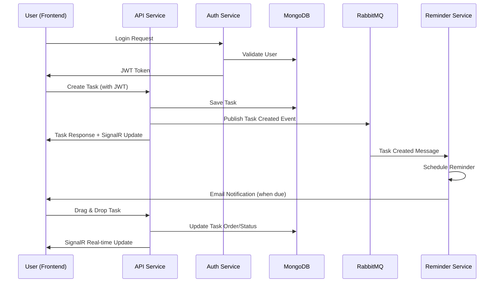

# Task Management System

A microservices-based task management application built with .NET 8, React TypeScript, and MongoDB.

## System Architecture

The system follows **Onion Architecture** principles with clear separation of concerns:

- **Domain Layer**: Core business entities and domain logic
- **Application Layer**: Business logic, DTOs, and service interfaces  
- **Infrastructure Layer**: Data access, external services, and messaging
- **API Layer**: REST endpoints, SignalR hubs, and presentation logic

**Tech Stack**: .NET 8, MongoDB, Redis, RabbitMQ, React TypeScript, Docker

## Service Breakdown

| Service | Responsibility |
|---------|----------------|
| **TaskManagement.API** | Main API endpoints, SignalR real-time updates, task CRUD operations |
| **TaskManagement.AuthService** | User authentication, JWT token management, user registration |
| **TaskManagement.ReminderService** | Background task reminders, email notifications via message queue |
| **TaskManagement.Frontend** | React TypeScript UI, Kanban board, drag-and-drop functionality |

**Supporting Infrastructure**:
- **MongoDB**: Primary database for tasks and users
- **Redis**: Caching and SignalR backplane
- **RabbitMQ**: Message queue for inter-service communication

## High-Level Design

### Services Architecture
```
                        ┌─────────────────┐
                        │   Frontend      │
                        │  (React TS)     │
                        │  Port: 3000     │
                        └─────────┬───────┘
                                  │
                        ┌─────────┴─────────┐
                        │                   │
                        ▼                   ▼
           ┌─────────────────┐    ┌─────────────────┐
           │   API Service   │    │  Auth Service   │
           │   (.NET 8)      │    │   (.NET 8)      │
           │   Port: 5000    │    │   Port: 5001    │
           └─────────┬───────┘    └─────────┬───────┘
                     │                      │
                     │                      ▼
                     │            ┌─────────────────┐
                     │            │    MongoDB      │
                     │            │   (Users DB)    │
                     │            └─────────────────┘
                     │
                     ├──────────────────────────────┐
                     │                              │
                     ▼                              ▼
           ┌─────────────────┐              ┌─────────────────┐
           │    MongoDB      │              │    RabbitMQ     │
           │   (Tasks DB)    │              │   (Messages)    │
           └─────────────────┘              └─────────┬───────┘
                                                      │
                                                      ▼
                                            ┌─────────────────┐
                                            │ Reminder Service│
                                            │   (.NET 8)      │
                                            │  Background     │
                                            └─────────────────┘
```

### Communication Flow
```
┌─────────────┐   HTTP/SignalR   ┌─────────────┐   RabbitMQ   ┌─────────────┐
│   Frontend  │◄─────────────────│ API Service │─────────────►│  Reminder   │
└─────────────┘                  └─────────────┘              │  Service    │
       │                                │                     └─────────────┘
       │ JWT Auth                       │
       ▼                                ▼
┌─────────────┐                  ┌─────────────┐
│Auth Service │                  │    Redis    │
└─────────────┘                  │  (Cache +   │
                                 │  SignalR)   │
                                 └─────────────┘
```

### Data Flow
1. **Authentication**: Frontend ↔ Auth Service ↔ MongoDB (Users)
2. **Task Operations**: Frontend ↔ API Service ↔ MongoDB (Tasks)
3. **Real-time Updates**: API Service → Redis → SignalR → Frontend
4. **Background Jobs**: API Service → RabbitMQ → Reminder Service
5. **Notifications**: Reminder Service → Email/Push notifications

## Setup and Run

```bash
docker-compose up
```

The application will be available at:
- Frontend: http://localhost:3000
- API: http://localhost:5000
- Auth Service: http://localhost:5001

## Sample Data

Run the PowerShell script to generate sample data:
```powershell
.\SeedDataSample.ps1
```

This creates test users, tasks, and comments for development.

## Sequence Diagram

